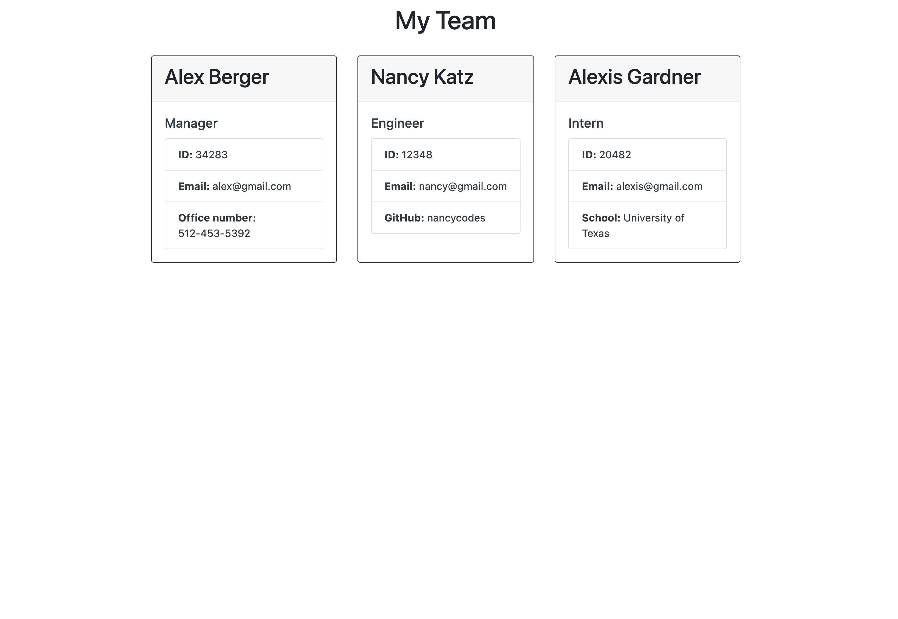

# Team Profile Generator

## Description
A Node.js command line application that takes input about employees on an engineering team and generates an HTML page  with a summary about  each employee. The project also includes unit tests for each function in the code.
  
## Table of Contents
- [Installation](#installation)
- [Usage](#usage)
- [Contributing](#contributing)
- [Tests](#test)
- [License](#license)
- [Questions](#questions)
  
## Preview
This [walkthrough video](https://drive.google.com/file/d/1ZCeY5yY0bbW-7o2rz4_NmjDg9ZAL52UV/view?usp=sharing) demonstrates the application functionality. 
Screenshot: 

## Installation
Install Node.js with `homebrew install node`. Install Inquirer with `npm inquirer i@8.2.4`. Install Jest with  `npm i jest`.
  
## Usage
Run the application with `node index`. Then, answer each of the questions as prompted until the roster is complete.

## Tests
Run `npm test` in the `__tests__` folder.
  
## License
Learn more about [MIT](https://choosealicense.com/licenses/mit/).
  
## Questions
GitHub Username: aberger3647

You can reach me with any questions at aberger3647@gmail.com.
